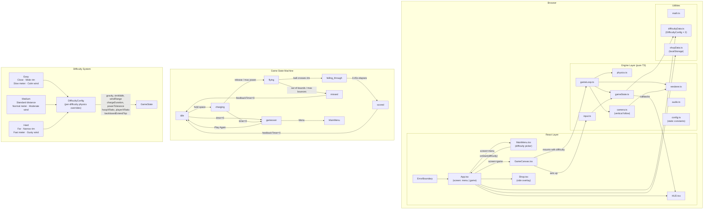

# Free Throw Frenzy — Architecture Diagram

```mermaid
flowchart TD
    subgraph Browser
        subgraph React["React Layer"]
            App["App.tsx\n(screen: menu | game)"]
            Menu["MainMenu.tsx\n(difficulty picker)"]
            GC["GameCanvas.tsx"]
            HUD["HUD.tsx"]
            ShopUI["Shop.tsx\n(side overlay)"]
            EB["ErrorBoundary"]
        end
        subgraph Engine["Engine Layer (pure TS)"]
            GL["gameLoop.ts"] --> PHY["physics.ts"]
            GL --> CAM["camera.ts\n(vertical follow)"]
            GL --> REN["renderer.ts"]
            GL --> GS["gameState.ts"]
            CAM --> REN
            INP["input.ts"] --> GS
            AUD["audio.ts"]
            CFG["config.ts\n(static constants)"]
        end
        subgraph Utils["Utilities"]
            MATH["math.ts"]
            SHOP["shopData.ts\n(localStorage)"]
            DIFF["difficultyData.ts\n(DifficultyConfig × 3)"]
        end

        EB --> App
        App -->|"screen=menu"| Menu
        App -->|"screen=game"| GC
        App --> HUD
        App --> ShopUI
        Menu -->|"onStart(difficulty)"| App
        GC -->|"mounts with difficulty"| GL
        GC -->|"sets up"| INP
        GS -->|"callbacks"| HUD
        GS --> DIFF
        App --> SHOP
        App --> DIFF
    end

    subgraph GameFlow["Game State Machine"]
        idle -->|"hold space"| charging
        charging -->|"release / max power"| flying
        flying -->|"ball crosses rim"| falling_through
        falling_through -->|"0.45s elapses"| scored
        flying -->|"out of bounds / max bounces"| missed
        scored -->|"feedbackTimer=0"| idle
        missed -->|"feedbackTimer=0"| idle
        idle -->|"timer=0"| gameover
        charging -->|"timer=0"| gameover
        gameover -->|"Play Again"| idle
        gameover -->|"Menu"| MainMenu
    end

    subgraph DifficultySystem["Difficulty System"]
        easy["Easy\nClose · Wide rim\nSlow meter · Calm wind"]
        medium["Medium\nStandard distance\nNormal meter · Moderate wind"]
        hard["Hard\nFar · Narrow rim\nFast meter · Gusty wind"]
        DifficultyConfig["DifficultyConfig\n(per-difficulty physics overrides)"]
        easy --> DifficultyConfig
        medium --> DifficultyConfig
        hard --> DifficultyConfig
        DifficultyConfig -->|"gravity, rimWidth, windRange\nchargeDuration, powerTolerance\nhoopXRatio, playerXRatio\nbackboardExtendTop"| GameState
    end
```
